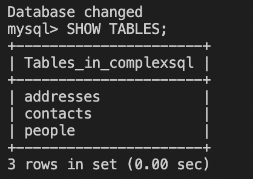

 
 
## Week6 : Working with MySQL 

In this lab, I perform little more complex SQL queries on data stored in MySQL.

First, I generated fake data from Faker library ans stored them into 3 different tables.

    

Shown below are the table columns:

    

# Comples Queries

    1. List of people with their email addresses and addresses

    query1 = """
    SELECT p.firstname, p.lastname, c.emails, a.addresses
    FROM people p
    LEFT JOIN contacts c ON p.id = c.customer_id
    LEFT JOIN addresses a ON p.id = a.customer_id
    """
        
    2. Number of people who have both an email and an address

    query2 = """
    SELECT COUNT(*)
    FROM people p
    WHERE EXISTS (
        SELECT 1 FROM contacts c WHERE p.id = c.customer_id
    ) AND EXISTS (
        SELECT 1 FROM addresses a WHERE p.id = a.customer_id
    )
    """
# Test

To test the program, I run another database queries where I check if the database contains correct number of total entries for all three tables.